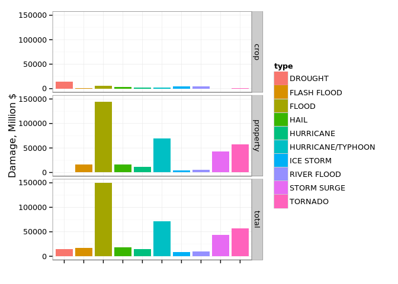

# Storm Data
Oleg Nizhnikov  
23.10.2015  


reading file

```r
library(R.utils)
library(dplyr)
```

```r
storm.head <- read.csv("stormData.csv.bz2", nrows = 100)

storm.classes <- sapply(storm.head, class)
storm.classes["BGN_TIME"] <- "character"
storm.classes["F"] <- "factor"

storm.classes[storm.classes == "logical"] = "factor"

multiplier <- function(letter) 
  ifelse( letter == "K", 1e3,
  ifelse( letter == "M", 1e6,
  ifelse( letter == "B", 1e9,
  1)))

storm.by.type <- read.csv("stormData.csv.bz2", 
                          colClasses = storm.classes) %>% 
  group_by(EVTYPE) %>%
  mutate(
    PROPDMG = PROPDMG * multiplier(PROPDMGEXP), 
    CROPDMG = CROPDMG * multiplier(CROPDMGEXP)
  ) %>%
  summarise(
    mean.injuries   = mean(INJURIES, na.rm = TRUE),
    mean.fatalities = mean(FATALITIES, na.rm = TRUE),
    mean.propdmg    = mean(PROPDMG, na.rm = TRUE),
    mean.cropdmg    = mean(CROPDMG, na.rm = TRUE),
    
    sum.injuries   = sum(INJURIES, na.rm = TRUE),
    sum.fatalities = sum(FATALITIES, na.rm = TRUE),
    sum.propdmg    = sum(PROPDMG, na.rm = TRUE),
    sum.cropdmg    = sum(CROPDMG, na.rm = TRUE)
    )
```


```r
library(ggplot2)
library(tidyr)
```

```
## 
## Attaching package: 'tidyr'
## 
## The following object is masked from 'package:R.utils':
## 
##     extract
```

```r
storm.dmg <- storm.by.type %>% 
  select(type = EVTYPE,
         crop = sum.cropdmg, 
         property = sum.propdmg) %>%
  mutate(total = crop + property) %>%
  arrange(total) %>%
  tail(n = 10) %>%
  gather(kind, damage, c(crop, property, total))

summary(storm.dmg)
```

```
##                 type          kind        damage         
##  DROUGHT          : 3   crop    :10   Min.   :5.000e+03  
##  FLASH FLOOD      : 3   property:10   1st Qu.:4.214e+09  
##  FLOOD            : 3   total   :10   Median :1.292e+10  
##  HAIL             : 3                 Mean   :2.720e+10  
##  HURRICANE        : 3                 3rd Qu.:3.718e+10  
##  HURRICANE/TYPHOON: 3                 Max.   :1.503e+11  
##  (Other)          :12
```

```r
ggplot(storm.dmg, aes(type, damage / 1e6)) + 
  geom_bar( stat = "identity",
            aes(fill = type)) +
  ylab("Damage, Million $") +
  facet_grid(kind ~ .) +
  scale_x_discrete(expand = c(0,0)) +
  theme_bw()
```

 

