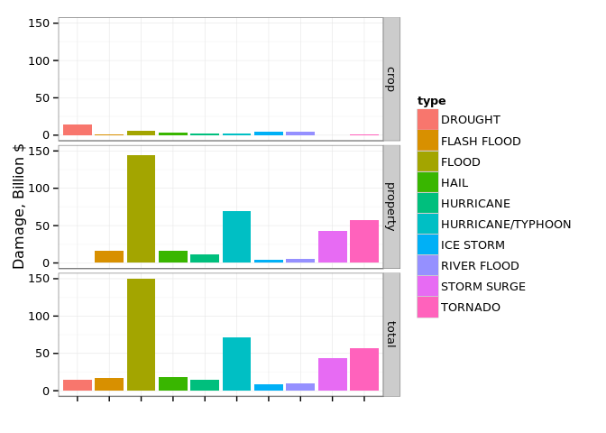
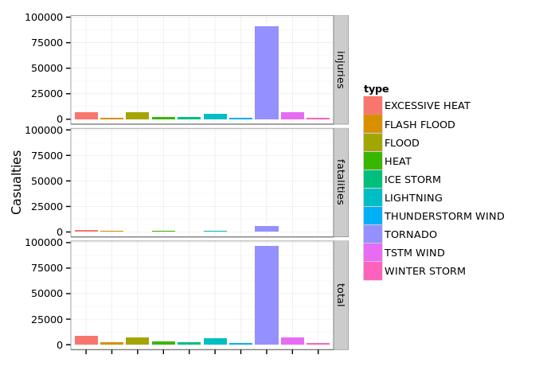

# Health and Economic damage of Storms in the United States
Oleg Nizhnik  
25.10.2015  

## Synopsis

This research based on U.S. National Oceanic and Atmospheric Administration's (NOAA) storm database. Data on different kind of major storms and weather events is summarized and analyzed to find out which event types have the most dramatic health and economic damage.

## Data Processing

Data collected from [this link][1].  
We will read whole CSV, gather 4 most interesting characteristics:

| No | Name                                 | Stored in Column  | Multiplier in Column   |
|---:|:------------------------------------:|:-----------------:|:----------------------:|
| 1  |**Property Damage**                   | `PROPDMG`         | `PROPDMGEXP`           |
| 2  |**Crops Damage**                      | `CROPDMG`         | `CROPDMGEXP`           |
| 3  |**Count of non-lethal health damage** | `INJURIES`        | **-**                  |
| 4  |**Count of lethal health damage**     | `FATALITIES`      | **-**                  |


```r
library(R.utils)
library(dplyr)
```

```r
storm.head <- read.csv("stormData.csv.bz2", nrows = 100)

storm.classes <- sapply(storm.head, class)
storm.classes["BGN_TIME"] <- "character"
storm.classes["F"] <- "factor"

storm.classes[storm.classes == "logical"] = "factor"

multiplier <- function(letter) 
  ifelse( letter == "K", 1e3,
  ifelse( letter == "M", 1e6,
  ifelse( letter == "B", 1e9,
  1)))

storm.by.type <- read.csv("stormData.csv.bz2", 
                          colClasses = storm.classes) %>% 
  group_by(EVTYPE) %>%
  mutate(
    PROPDMG = PROPDMG * multiplier(PROPDMGEXP), 
    CROPDMG = CROPDMG * multiplier(CROPDMGEXP)
  ) %>%
  summarise(
    mean.injuries   = mean(INJURIES, na.rm = TRUE),
    mean.fatalities = mean(FATALITIES, na.rm = TRUE),
    mean.propdmg    = mean(PROPDMG, na.rm = TRUE),
    mean.cropdmg    = mean(CROPDMG, na.rm = TRUE),
    
    sum.injuries   = sum(INJURIES, na.rm = TRUE),
    sum.fatalities = sum(FATALITIES, na.rm = TRUE),
    sum.propdmg    = sum(PROPDMG, na.rm = TRUE),
    sum.cropdmg    = sum(CROPDMG, na.rm = TRUE)
    )
```

## Visual Analysis
We will collect 10 most harmful storm types depending on economic and health losses

```r
library(tidyr)
storm.economic <- storm.by.type %>% 
  select(type = EVTYPE,
         crop = sum.cropdmg, 
         property = sum.propdmg) %>%
  mutate(total = crop + property) %>%
  arrange(total) %>%
  tail(n = 10) %>%
  gather(kind, damage, c(crop, property, total))

storm.health <- storm.by.type %>%
  select(type = EVTYPE, 
         injuries = sum.injuries, 
         fatalities = sum.fatalities) %>%
  mutate(total = injuries + fatalities) %>%
  arrange(total) %>%
  tail(n = 10) %>%
  gather(kind, damage, c(injuries, fatalities, total))
```
And prepare visual tools for those

```r
library(ggplot2)

colorful.bars <- function(plot) plot +
    facet_grid(kind ~ .) +
    xlab("") +
    theme_bw() +
    theme(axis.text.x = element_blank()) +
    geom_bar(stat = "identity",  aes(fill = type))

plot.economic <- ggplot(storm.economic, aes(type, damage / 1e9)) + ylab("Damage, Billion $") 

plot.health <- ggplot(storm.health, aes(type, damage)) + ylab("Casualties")
```
Here we can see economic damage, respecting property damage, crop damage and sum of these

```r
colorful.bars(plot.economic)
```

 

Here the health damage, differentiating lethal, non-letal and all cases


```r
colorful.bars(plot.health)
```

 

#Results

Most harmful factors are:

```r
worst.economic <- storm.economic %>% filter(kind == "total") %>% tail(n = 1) 
worst.health <- storm.health %>% filter(kind == "total") %>% tail(n = 1)
options(scipen = 999)
```

| Category | Event type              | Value                                    |
|:--------:|:-----------------------:|-----------------------------------------:|
| Economic | FLOOD | $150.3196783 billions| 
| Health   | TORNADO   | 96979 casualties       |


[1]:https://d396qusza40orc.cloudfront.net/repdata%2Fdata%2FStormData.csv.bz2
